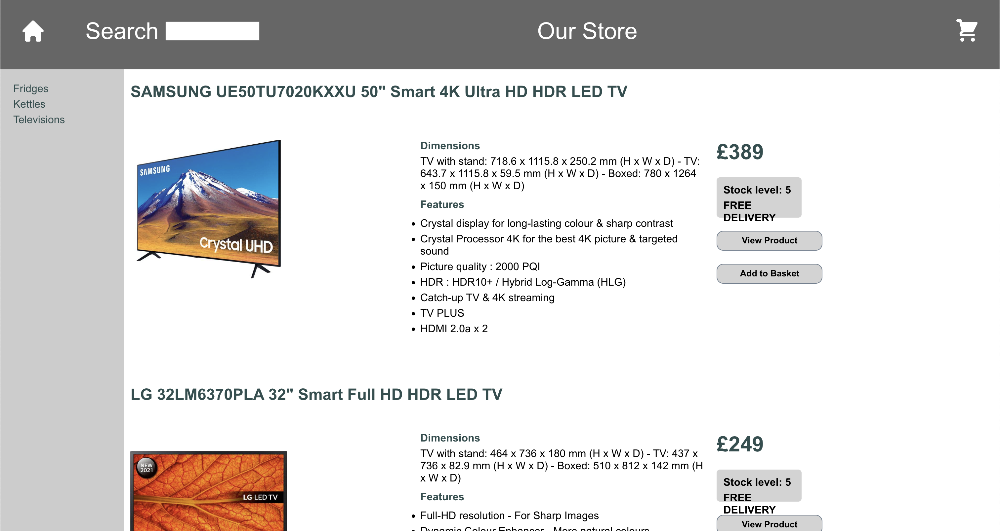
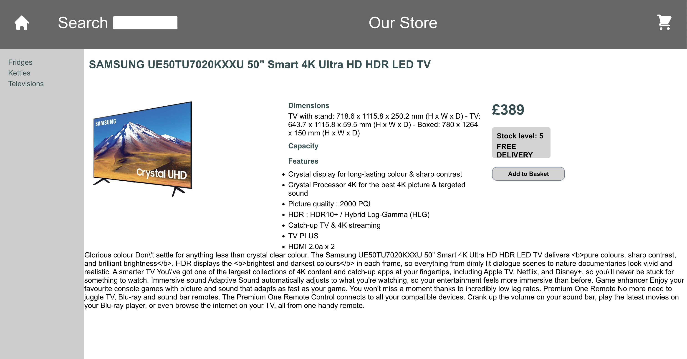
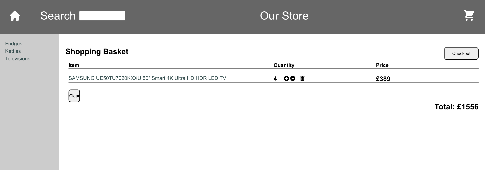
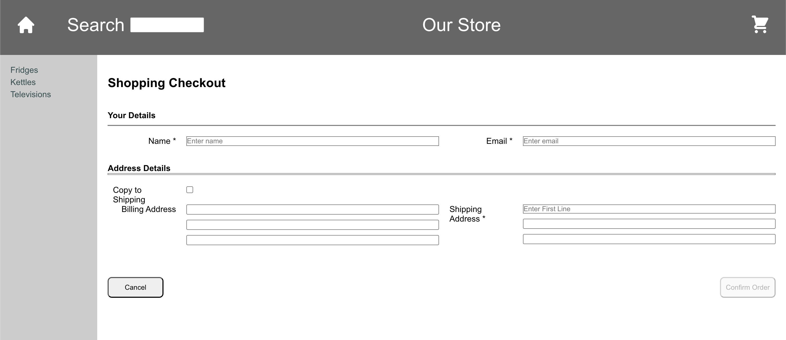

# 🛒 E-Store: Electronics Shopping Web App

A responsive, category-based electronics shopping site built using **React**, styled with **HTML/CSS**, and powered by **JavaScript**.  
It simulates a functional e-commerce flow using `json-server` to provide mock API data.

---

## 🔧 Tech Stack

- **Frontend:** React, HTML5, CSS3, JavaScript (ES6+)
- **API Mock:** [json-server](https://github.com/typicode/json-server)

---

## 📦 Features

✅ **Category-Based Product Browsing**  
→ Users can browse electronic items grouped by category (e.g., Fridges, Kettles, Televisions).

✅ **Product Detail Page**  
→ Clicking on a product opens a dedicated detail view with descriptions and pricing.

✅ **Cart Functionality**  
→ Users can add/remove items from a cart, see a summary, and update quantities.

✅ **Checkout Form**  
→ A simple payment form simulates a full checkout experience (non-functional).

✅ **Responsive Design**  
→ Fully usable on desktop, tablet, and mobile devices.

---

## 📸 Screenshots

| Main Product View | Product Detail |
|------------------|----------------|
|  |  |

| Cart Overview | Checkout Form |
|----------------|----------------|
|  |  |

---

## 🎯 What I Learned

This project helped me:
- Understand basic e-commerce flow and state management in React
- Practice using `fetch` to retrieve data from a mock API
- Improve UI/UX handling for interactivity (hover, buttons, modals)
- Build mobile-responsive layouts

---

## 💬 Contact

Made by Emily Chung (twih1203@gmail.com) 
For questions or feedback, feel free to reach out!
